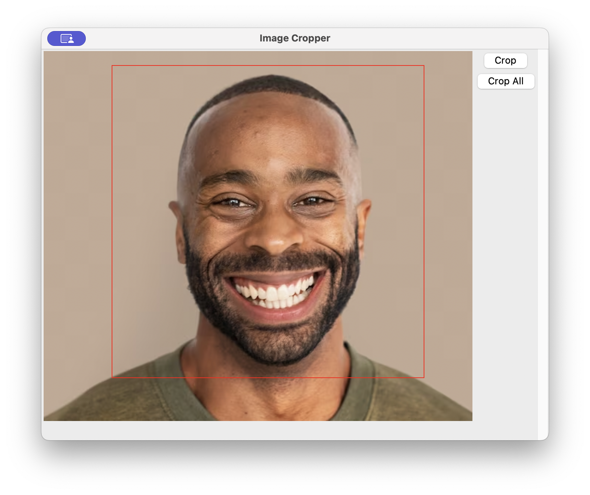

# Data Processing

## Table of Contents
<details>
  <summary>Table of Contents</summary>
  <ol>
    <li><a href="#overview">Overview</a></li>
    <li><a href="#data-flow-diagram">Data Flow Diagram</a></li>
    <li><a href="#process-pupillometry">Process Pupillometry Data</a></li>
    <li><a href="#process-facial">Process Facial Videos</a></li>
    <li><a href="#expected-result">Expected Result</a></li>
  </ol>
</details>

## Overview
- This document illustrates the automated data processing pipeline
- From the data collected, there should be videos of each participant's facial expression for each emotion, as well as pupillometry data collected from the GazePoint.
- The expected naming convention for the videos is `<participant_id>_<emotion>.mp4`. For example
`cs_happy.mp4`. This is necessary for the automation to work.
- From the GazePoint software, the pupillometry data must be exported as a `.csv` file with the following columns:
  - MEDIA NAME
  - TIME 
  - LPD
  - RPD
- Important Note: the TIME field in the `.csv` file includes the current date and time. This must be renamed to 'TIME' for the automation script to work.

## Data Flow Diagram
The following is a high-level data flow diagram.

Pupillometry Data (.csv) --> MATLAB script --> Python script --> Continuous Function (.pkl)

Facial Videos (.mp4) --> Python script --> Cropped Images Split into Train/Val/Test + the timestamp of the frame in each dataset

## Process Pupillometry Data

### Preparing the Data
1. Name each participant in the GazePoint software with a unique identifier (without special characters). 
2. From the GazePoint, export to `.csv` with the following fields
   - MEDIA NAME
   - TIME
   - LPD
   - RPD
3. Rename the TIME field to 'TIME' for each participant in the `.csv`
4. Replace the dictionary in the `pupil/process_data.py` file with the videos as the keys and the emotions they correspond to as the values. For example:
```python
SEG_NAME_TO_EMOTION = {
    "1.mp4": "joy",
    "2.mp4": "anger",
    "3.mp4": "fear",
    "4.mp4": "fun",
    "5.mp4": "sad",
    "6.mp4": "happy",
    "7.mp4": "calm",
}
```
5. Ensure that all the `.csv` files to be processed are in the same directory. We will refer to this as the `pupil_data_dir`.

### Removing Outliers (MATLAB)

1. Open MATLAB. 
2. Run the processing script `process_data.m` which requires the following parameters:

    ```m
    process_data(dir, in_csv_file, mat_file, data_csv_file, seg_csv_file, plot_data)
    ```
    Here are the details:
    - `dir`: this refers to the `pupil_data_dir` specified above.
    - `in_csv_file`: the name of the `.csv` file from the GazePoint.
    - `mat_file`: the name of the `.mat` file to save the variables to.
    - `data_csv_file`: the name of the `.csv` file to save the data to.
    - `seg_csv_file`: the name of the `.csv` file to save the segment data to. This includes the segments' start times, end times, and names.
    - `plot_data`: a boolean to specify whether or not to generate a plot of the data.
  
3. Repeat for each participant.

Here is a sample call from the MATLAB shell: 
```shell
process_data.m /pupil_data_dir/ pupil_cs.csv pupil_cs.mat data_cs.csv segments_cs.csv true 
```
### Convert to Continuous Function (Python)
Currently the outputted data is discrete. The previous section also removes outliers, which allows for gaps in the data. For this reason, we use interpolation to create a continuous function from the remaining data.

1. Run the python script `pupil/process_data.py` with the `pupil_data_dir` as an input parameter.
2. Check that there is one `.pkl` file for each participant and emotion. For example `cs_happy.pkl`. 

## Process Facial Videos

1. Start with all of the participants' facial videos in one directory. We will refer to this as the `face_data_dir`
```shell
    /face_data_dir
        cs_happy.mp4
        cs_sad.mp4
        mf_happy.mp4
        mf_sad.mp4
```
2. Run the `face/process_data.py` script. This requires the following parameters:
    ```python
    def process_data(
        video_dir: Path,
        output_path: Path,
        binary: bool,
        get_frames: bool = True,
        crop_images: bool = True,
    ) -> Path:
    ```
   - `video_dir`: the `face_data_dir` specified above.
   - `output_path`: the output directory for the processed images.
   - `binary`: a boolean specifying the type of classification. When set to `True` emotions will be classified as 'positive' or 'negative'. Otherwise, it will use the emotion from the video names.
   - `get_frames`: a boolean specifying whether the video should be separated to images. If `True`, it will run the video --> image sequence tool.
   - `crop_images`: a boolean specifying whether the separated images should be cropped. If `True` it will provide a cropping UI for each participant and emotion. 
  
  Here is an example on how it is run:
  ```shell
  python3 face/process_data.py face_data_dir face_data_dir True True True
  ```
3. Once the command is run, if the `crop_images` option was set to `True`, then a UI will appear with an image for each participant and emotion. Select the region around the participant's face and click on `Crop All` to crop all images in the directory. This will repeat for each participant and emotion. 

  

## Expected Result
Before moving on to the model training and testing, please validate that the data is structured as follows:

- [ ] There is one `pupil_<participant_id>_<emotion>.pkl` per participant and emotion in the specified `pupil_data_dir`.
- [ ] In the `output_path` specified for the facial data processing, there are 3 subdirectories (train, val, test).
- [ ] In each of the train/val/test subdirectories, there are either:
  - [ ] 2 subdirectories (positive and negative) if  `binary` was `True` OR 
  - [ ] one subdirectory for each emotion otherwise.
- [ ] Validate that in each of the classes (emotion directories) the images are correctly moved (e.g. positive only contains happy, joy, calm, fun and negative only contains anger, fear, sadness)
- [ ] Validate that the images are cropped to a square around the face.

Great! Now you're ready to start training and testing the models. For instructions see the [models README](https://github.com/meriam04/emotion-watchers/models/README.md)